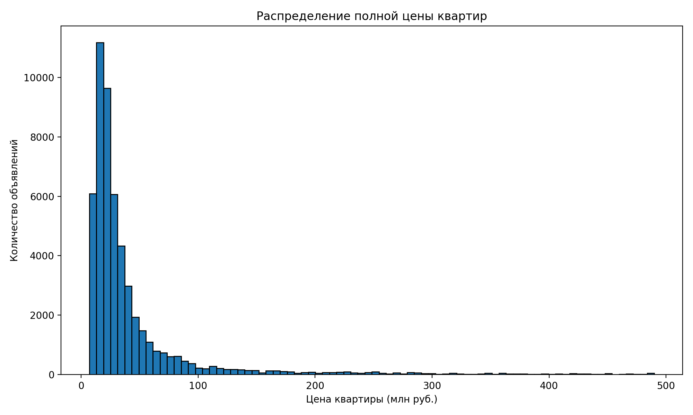
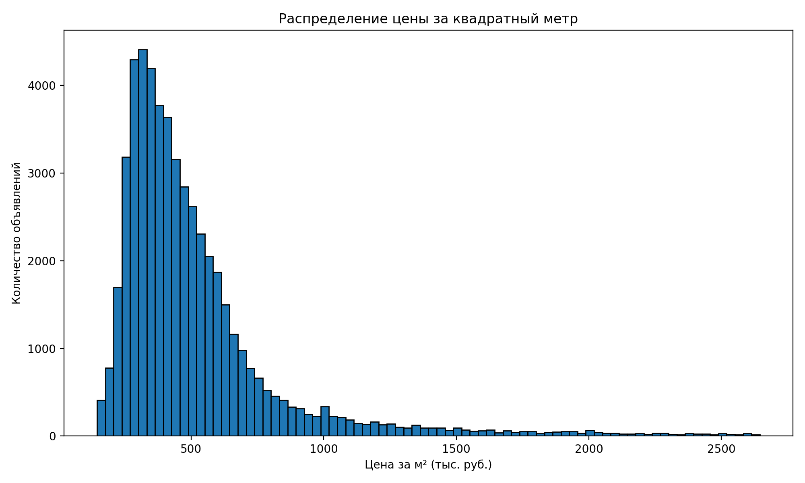
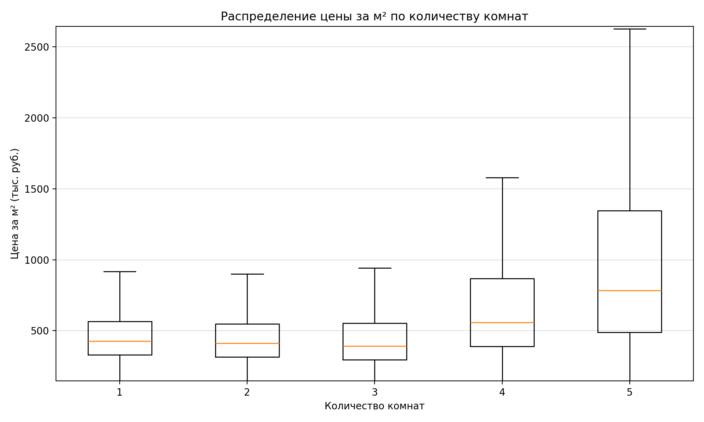

# Примеры данных и результатов анализа

## 📊 Данные

### unique.json
Полный датасет собранных объявлений о продаже 1-комнатных квартир в Москве.

**Структура данных**:
```json
{
  "title": "Продается 1-комн. квартира, 34,1 м²",
  "price": 8600000,
  "rooms": 1,
  "address": "Москва, ТАО (Троицкий), м. Ольховая, Троицк",
  "coordinates": [55.490585, 37.297512],
  "url": "https://www.cian.ru/sale/flat/...",
  "metro": [
    {"station": "Ольховая", "time": 20}
  ],
  "description": "...",
  "attributes": {
    "apartment": {"Общая площадь": 34.1, ...},
    "building": {"Год постройки": "2015", ...}
  }
}
```

**Использование**:
- Для тестирования модулей анализа
- Для обучения работе с данными парсера
- Для воспроизведения визуализаций

### district_stats.json
Агрегированная статистика по административным округам Москвы.

**Содержит**:
- `median_price_m2` - медианная цена за м² (тыс. руб.)
- `mean_price_m2` - средняя цена за м² (тыс. руб.)
- `count_ads` - количество объявлений в округе

**Интерпретация**:
- ЦАО имеет самую высокую медианную цену (~850 тыс. руб./м²)
- НАО (Новомосковский) - самую низкую (~285 тыс. руб./м²)
- Разница между медианой и средним показывает наличие выбросов

## 📈 Визуализации

### hist_total_price.png
**Распределение полной цены квартир**



**Что показывает**:
- Распределение цен на 1-комнатные квартиры в Москве
- Большинство квартир стоят от 8 до 15 млн рублей
- Правосторонняя асимметрия - есть дорогие квартиры (выбросы)

**Как читать**:
- Ось X: цена квартиры в миллионах рублей
- Ось Y: количество объявлений в данном ценовом диапазоне
- Пик распределения показывает наиболее типичную цену

### hist_price_m2.png
**Распределение цены за квадратный метр**



**Что показывает**:
- Распределение удельной цены (цена/площадь)
- Позволяет сравнивать квартиры разной площади
- Типичная цена за м²: 300-500 тыс. рублей

**Как читать**:
- Ось X: цена за м² в тысячах рублей
- Ось Y: количество объявлений
- Более узкое распределение, чем у полной цены

**Применение**:
- Оценка адекватности цены конкретного объявления
- Сравнение районов по стоимости жилья
- Выявление завышенных/заниженных цен

### boxplot_price_m2_by_rooms.png
**Сравнение цены за м² по количеству комнат**



**Что показывает**:
- Сравнение распределения цен для разных типов квартир
- Медиана, квартили и выбросы для каждой категории
- Зависимость цены за м² от количества комнат

**Как читать**:
- Прямоугольник (box) - 50% данных (от 25-го до 75-го перцентиля)
- Линия внутри box - медиана
- "Усы" - диапазон без выбросов
- Точки за усами - выбросы (аномально дорогие/дешевые квартиры)

**Выводы**:
- Однокомнатные квартиры обычно дороже за м², чем многокомнатные
- Больше выбросов в сегменте дорогих квартир
- Медианная цена снижается с ростом количества комнат

## 🔄 Воспроизведение результатов

Для генерации этих визуализаций из данных используйте:

```bash
# Установить зависимости
pip install -r requirements.txt

# Сгенерировать примеры (если нужно обновить)
python examples/generate_examples.py

# Запустить анализ (требуется ClickHouse)
python analyse/histogram.py
python analyse/district.py
```
